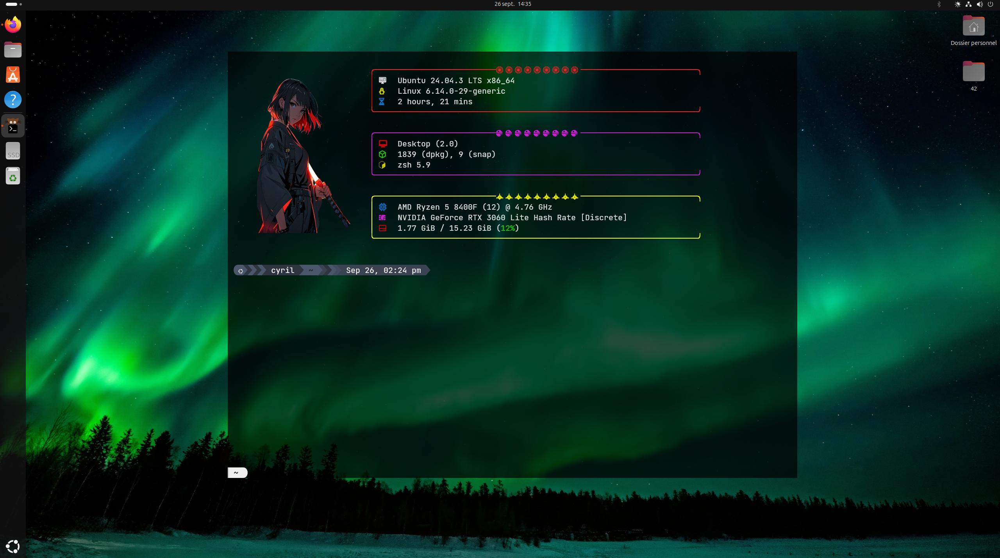

# 🚀 Mon terminal Kitty custom

Ce repo permet de reproduire rapidement mon terminal Kitty personnalisé sur Ubuntu avec :

- **Kitty officiel** comme terminal par défaut  
- **Zsh** avec configuration personnelle  
- **Starship** avec preset Nord_segements  
- **Fastfetch** pour un affichage stylé du système



---

## 📦 1. Installation des dépendances

### Installer Kitty

```bash
curl -L https://sw.kovidgoyal.net/kitty/installer.sh | sh /dev/stdin
```

### Installer Zsh et ses extensions

```bash
sudo apt install zsh zsh-autosuggestions zsh-syntax-highlighting
```
**pour la saisie auto**

```
% git clone --depth 1 -- https://github.com/marlonrichert/zsh-autocomplete.git
```

### Installer Starship
```bash
curl -sS https://starship.rs/install.sh | sh
```
### installer Fastfetch
Pour Ubuntu 24.10 et versions ultérieures :

```bash
sudo apt install fastfetch
```

Pour les anciennes versions d'Ubuntu :

```bash
sudo add-apt-repository ppa:zhangsongcui3371/fastfetch
sudo apt update
sudo apt install fastfetch
```
---

## 🐱 2. Définir Kitty comme terminal par défaut

```bash
sudo update-alternatives --install /usr/bin/x-terminal-emulator x-terminal-emulator $(which kitty) 50
sudo update-alternatives --config x-terminal-emulator
```
---

## 🔧 3. Patch & Configurations

### copier les fonts

```bash
mkdir -p ~/.fonts
cp fonts/* ~/.fonts/
fc-cache -fv
```

### copier le .zshrc

```bash
cp .zshrc ~/
```

### copier le kitty.conf

```bash
mkdir -p ~/.config/kitty
cp kitty.conf ~/.config/kitty/
```
### copier le dossier de config Fastfetch

```bash
cp -r fastfetch/* ~/.config/fastfetch/
```
### Activer le preset Starship

```bash
cp Starship/nord_segments.toml ~/.config/starship.toml
```
Voilà le tour est joué !
---

# 🛠️ Helpers:

lien vers la video it's foss qui recapitule les étapes :

https://www.youtube.com/watch?v=ffmm80_Cii4
