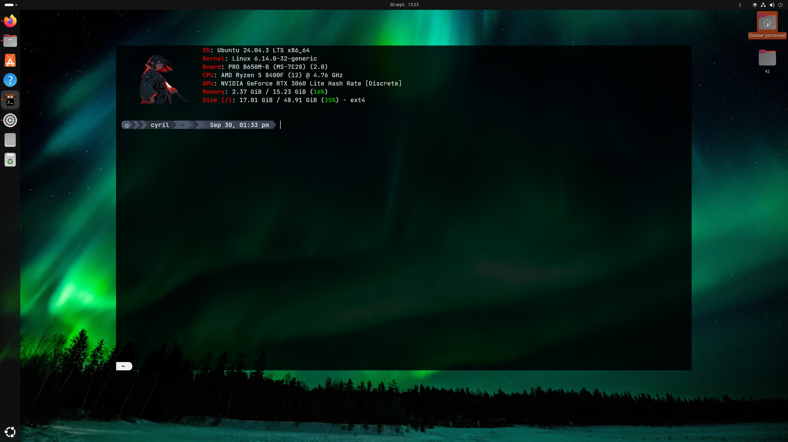

# My Custom Terminal + LazyVim

Ce repo permet de reproduire rapidement mon environnement de travail complet sur Ubuntu :

- **Kitty** comme terminal  
- **Zsh** avec configuration personnelle  
- **Starship** avec preset Nord_segments  
- **Fastfetch** pour un affichage stylé du système  
- **Neovim + LazyVim** avec transparence Tokyonight et plugins personnalisés

---

## 🚀 Installation

1. Cloner le repo :

```bash
git clone https://github.com/Cyril-glitch/my-custom-terminal.git
cd my-custom-terminal

```
2. Lancer le script d'installation :


```bash

bash install_env.sh

```
3. Redemarrer le terminal et lancer nvim pour verifier que tout fonctionne.

### Pour ne realiser que la partie terminal

# 🚀 Mon terminal Kitty custom

Ce repo permet de reproduire rapidement mon terminal Kitty personnalisé sur Ubuntu avec :

- **Kitty officiel** comme terminal par défaut
- **Zsh** avec configuration personnelle
- **Starship** avec preset Nord_segements
- **Fastfetch** pour un affichage stylé du système



---

## 📦 1. Installation des dépendances

### Installer Kitty

```bash
curl -L https://sw.kovidgoyal.net/kitty/installer.sh | sh /dev/stdin
```

### Installer Zsh et ses extensions

```bash
sudo apt install zsh zsh-autosuggestions zsh-syntax-highlighting
```
pour la saisie auto

```
% git clone --depth 1 -- https://github.com/marlonrichert/zsh-autocomplete.git
```

### Installer Starship
```bash
curl -sS https://starship.rs/install.sh | sh
```
### Installer Fastfetch
Pour Ubuntu 24.10 et versions ultérieures :

```bash
sudo apt install fastfetch
```

Pour les anciennes versions d'Ubuntu :

```bash
sudo add-apt-repository ppa:zhangsongcui3371/fastfetch
sudo apt update
sudo apt install fastfetch
```
---

## 🐱 2. Définir Kitty comme terminal par défaut

```bash
sudo update-alternatives --install /usr/bin/x-terminal-emulator x-terminal-emulator $(which kitty) 50
sudo update-alternatives --config x-terminal-emulator
```
---

## 🔧 3. Patch & Configurations

### 📥 Récupérer le repo

```bash
git clone https://github.com/Cyril-glitch/my-custom-terminal.git
cd my-custom-terminal
```

### Copier les fonts

```bash
mkdir -p ~/.fonts
cp fonts/* ~/.fonts/
fc-cache -fv
```

### Copier le .zshrc

Le .zshrc est le fichier de configuration de zsh.
C'est ici qu'on pourra activer ou desactiver les extensions.

```bash
cp .zshrc ~/
```

### Copier le kitty.conf

Le kitty.conf est le fichier de configuration de kitty.
Par exemple c'est ici qu'on pourra gérer la gestion de la fenêtre ( taille, opacité, images d'arriere plan etc...).

la commande suivante conserve le kitty.conf d'origine , il sera renommé en kitty.conf.bak , puis en crée un nouveau.

```bash
mv ~/.config/kitty/kitty.conf ~/.config/kitty/kitty.conf.bak
cp kitty.conf ~/.config/kitty/
```
### Copier le dossier de config Fastfetch

```bash
cp -r fastfetch/* ~/.config/fastfetch/
```
### Activer le preset Starship

```bash
cp Starship/nord_segments.toml ~/.config/starship.toml
```

Voilà le tour est joué !
---

## 🛠️ Helpers:

### Tips 1 :

L'option : hide_window_decorations est activé dans kitty.conf

Il faut donc utiliser les raccourcis clavier de votre gnome pour la gérer

ou

commenter cette option et décommenter l'option : hide_window_decorations titlebar-only

vous obtiendrez une barre de titre

### Tips 2 :

lien vers la video it's foss qui recapitule les étapes :

https://www.youtube.com/watch?v=ffmm80_Cii4
